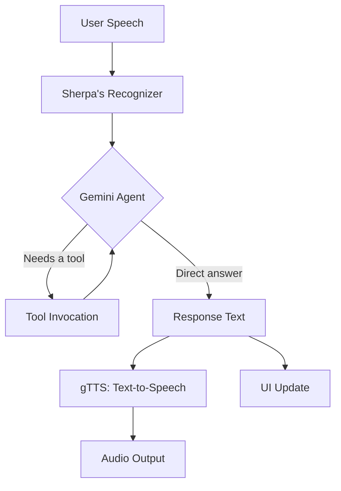

# Aura Virtual Assistant

## About

<p align="center">
  
</p>

This project was originally started in 2021. It has since been upgraded with real time speech processing, agenting based query handling powered by Gemini and more comprehensive audio outputs using gTTS. The UI has been written using the Qt framework and is heavily inspired by Microsoft's <a href="https://en.wikipedia.org/wiki/Cortana_(virtual_assistant)">Cortana</a>. The project is written with python and requires a Gemini API key to run. For further details, refer to the set up instructions given below.

## Architecture
Here is a basic architecture diagram illustrating the agent's workflow.


## Features
<ol>
  <li>Real time speech recognition and streaming made possible through Sherpa ONNX.</li>
  <li>
    A responsive agent which can answer queries and perform tasks powered by Gemini. The tasks that can be performed are
    <ul>
      <li><strong>Math Operations</strong> – Evaluate mathematical expressions</li>
      <li><strong>Get Context</strong> – Retrieve previous conversation context to answer follow-up questions</li>
      <li><strong>Get Date</strong> – Fetch today's date</li>
      <li><strong>Get Time</strong> – Fetch the current time</li>
      <li><strong>Execute Low-Priority Commands</strong> – Run commands that don't require elevated user privileges (excludes opening web pages)</li>
      <li><strong>Open Web Page</strong> – Open any web page as instructed by the user</li>
      <li><strong>Open Wiki Page</strong> – Fetch a summary of a Wikipedia page for a given topic</li>
      <li><strong>Search YouTube Video</strong> – Find and open a YouTube video based on title</li>
      <li><strong>Update About</strong> – Store user details (e.g. name) in memory for future context</li>
      <li><strong>Read About</strong> – Retrieve stored user details when they're relevant to the response</li>
      <li><strong>Update To-Do</strong> – Add a task to the user's to-do list</li>
      <li><strong>Read To-Do</strong> – Retrieve the user's current to-do list</li>
      <li><strong>Remove To-Do</strong> – Remove a task from the to-do list by its position/index</li>
    </ul>
  </li>
  <li>Dynamically manage and query context through the use of vector databases</li>
  <li>Dynamically update the profile of the user for a more personalized experience (file stored locally)</li>
</ol>

## Set Up Instructions
To set this project up, firstly, create a virtual environment and activate it. Clone the repository using git
```bash
git clone https://github.com/null-mtrx/aura-virtual-assistant
```
Download Sherpa Onnx for the recogniser from <a href="https://k2-fsa.github.io/sherpa/onnx/pretrained_models/index.html">here</a>. Install the requirements as mentioned in requirements.txt
```bash
pip install -r requirements.txt
```
Get your google API key from <a href="https://aistudio.google.com/">here</a>. The examples directory has a template `.env` and a `config.json` file. Copy them outside the examples directory and set the API key in the `.env`. In the config file, for the listeners section, add the paths to the required directories in the downloaded path. For further reference, read <a href="https://k2-fsa.github.io/sherpa/onnx/pretrained_models/index.html">here</a>. My example configuration looks like 
```json
{
    "listener_params": {
        "encoder_path": "/path/to/model/sherpa-onnx-x-asr-160ms-streaming-zipformer-transducer-zh-en-int8-2026-06-05/encoder.int8.onnx",
        "decoder_path": "/path/to/model/sherpa-onnx-x-asr-160ms-streaming-zipformer-transducer-zh-en-int8-2026-06-05/decoder.onnx",
        "joiner_path": "/path/to/model/sherpa-onnx-x-asr-160ms-streaming-zipformer-transducer-zh-en-int8-2026-06-05/joiner.int8.onnx",
        "tokens": "/path/to/model/Voice-Assistant/sherpa-onnx-x-asr-160ms-streaming-zipformer-transducer-zh-en-int8-2026-06-05/tokens.txt"
    },
    "speaker_params": {
        "language": "en",
        "accent": "co.uk"
    },
    "agent_dets": {
        "vector_store": "/path/to/kb",
        "data_path": "/path/to/about/"
    },
    "ui": {
        "mic-icon": "./src/assets/mic-icon.svg",
        "setting-icon": "./src/assets/sliders.svg",
        "wifi-up-icon": "./src/assets/wifi.svg",
        "wifi-down-icon": "./src/assets/wifi-off.svg"
    }
}
```
Once done, run main.py
```bash
python main.py
```

## Tech Stack
The following project is written purely in python with the following libraries being used
1. PySide6 for UI
2. Sherpa ONNX for real time speech to text conversion
3. Langchain and Langgraph for the agent
4. gTTS for the output

Other modules are used in various tools which can all be installed using the `requirements.txt`

## Limitations
> [!NOTE] This is a student project and is not meant to be treated as a professional grade software. There are bugs in multiple areas which would need fixing

1. Some bugs present in the UI need to be updated such as the UI struggling to display larger outputs
2. Unpolished animations with no interpolation between each state change causing choppiness at some places
3. Lesser overall tools which need; with more needing to be implemented
4. LLM is not immune to prompt injection. Prompting strategies need to be improved. 
